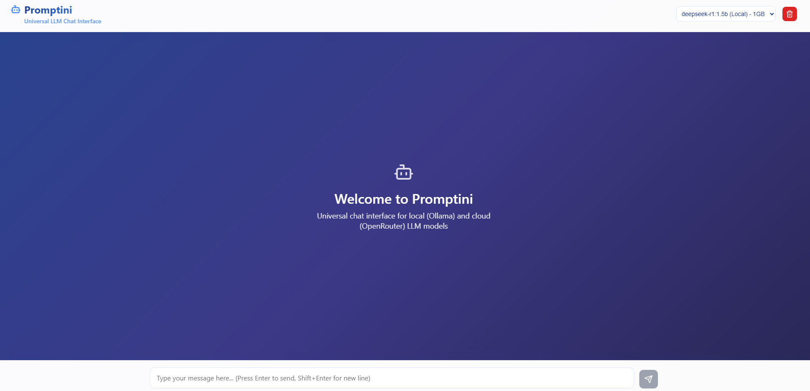

# Promptini

Universal LLM chat interface powered by Ollama and OpenRouter. Chat with local models or cloud APIs.



## Features

- **Dual Provider Support**: Local models via Ollama + Cloud models via OpenRouter
- Universal support for any compatible model
- Real-time chat with typing indicators  
- Responsive design with elegant UI
- Markdown rendering for AI responses
- Session-based chat history
- Dynamic model detection and switching

## Quick Start

### Option 1: Local Models (Ollama)
1. Install [Ollama](https://ollama.ai) and pull a model:
   ```bash
   ollama pull llama2
   # or
   ollama pull deepseek-r1:1.5b
   ```

### Option 2: Cloud Models (OpenRouter)
1. Get an API key from [OpenRouter](https://openrouter.ai/keys)
2. Copy `server/.env.example` to `server/.env`
3. Add your API key: `OPENROUTER_API_KEY=your_key_here`

### Setup & Run
1. Clone and install:
   ```bash
   git clone https://github.com/S4CH/promptini.git
   cd promptini
   npm install
   ```

2. Start the application:
   ```bash
   npm run dev
   ```

3. Open http://localhost:3000 and start chatting!

## Development

```bash
npm run dev      # Start both frontend and backend
npm run client   # Frontend only (port 3000)
npm run server   # Backend only (port 3001)
```

## API

- `GET /api/models` - List available models from both Ollama and OpenRouter
- `POST /api/chat` - Send message (includes provider selection)
- `GET /api/chat/history` - Get history
- `DELETE /api/chat/history` - Clear history

## Configuration

### Local Models (Ollama)
- Install Ollama and pull models: `ollama pull <model-name>`
- Models appear as "Local" in the dropdown

### Cloud Models (OpenRouter)
- Create `server/.env` file with your API key:
  ```env
  OPENROUTER_API_KEY=your_key_here
  ```
- Models appear as "Cloud" in the dropdown

## Tech Stack

- **Frontend**: React, axios, react-markdown
- **Backend**: Node.js, Express, Ollama client, OpenRouter API
- **Providers**: Ollama (local), OpenRouter (cloud)
- **Styling**: CSS with glassmorphism effects

## License

This project is licensed under the MIT License - see the [LICENSE](LICENSE) file for details.

---

⭐ If you found this project helpful, please give it a star on GitHub!
